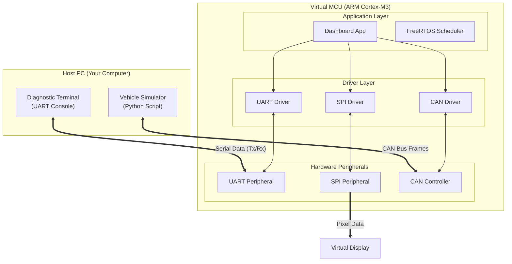
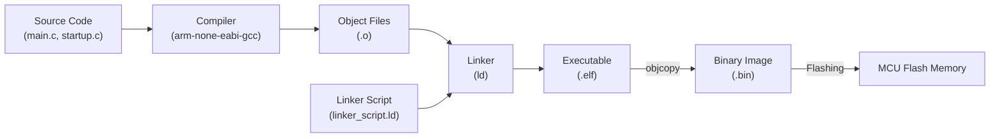

# Automotive Firmware Development Course
## The "Virtual Instrument Cluster" Project

**Author**: The Owner (Assisted by AI)

Welcome to the **Automotive Firmware Development Course**. In this project, you will build the firmware for a **Digital Dashboard** (Instrument Cluster) from scratch.

Instead of just "using libraries", we will build everything from the ground up to understand exactly how software interacts with silicon.

### System Architecture
We are simulating a modern automotive ECU (Electronic Control Unit).



---

## What is Happening Under the Hood?

### 1. The Build Process (Module 1)
Before we run any code, we must convert your C files into a binary image that the processor can execute.



*   **Compiler**: Translates C to Assembly, then to Machine Code (0s and 1s).
*   **Linker Script**: The map that tells the Linker *where* to put code and data in memory (e.g., Code goes to Flash `0x00000000`, Variables go to RAM `0x20000000`).
*   **Startup Code**: The very first code that runs. It copies data from Flash to RAM so your variables work.

### 2. Memory Mapped I/O (Module 1)
How do we turn on an LED or send a character? We write to magic memory addresses!

*   **The CPU's View**: To the CPU, a "Peripheral" (like a GPIO port) looks just like a variable in memory.
*   **The Hardware's View**: When the CPU writes to that address, the hardware catches the signal and flips a physical switch (transistor).

---

## What Exactly IS "Firmware" Here?
You might ask: "Is the C code the firmware? Is the binary the firmware?"
**Everything** in this repository is Firmware, but it falls into three distinct layers.

### Layer 1: System Firmware (The "Plumbing")
*   **Files**: `startup.c`, `linker_script.ld`
*   **Definition**: Code that is absolutely required for the chip to even wake up. It handles the electrical startup sequence.
*   **Analogy**: The BIOS/UEFI on your PC.
*   **Key Line**: `Reset_Handler` in `startup.c`. This is the very first instruction the silicon executes.

### Layer 2: Driver Firmware (The "Translator")
*   **Files**: `uart_driver.c`, `spi_driver.c`, `can_driver.c`
*   **Definition**: Code that knows how to talk to the specific silicon peripherals (registers). It translates "Send 'A'" into "Write 0x41 to Address 0x40004404".
*   **Analogy**: The Graphics Driver on your PC.
*   **Key Line**: `UART1->DR = c;`. This directly toggles the voltage on the TX pin.

### Layer 3: Application Firmware (The "Brain")
*   **Files**: `main.c`, `display_driver.c` (High level logic)
*   **Definition**: The business logic. It decides *what* to do (e.g., "If RPM > 5000, turn on Red LED"). It doesn't care *how* the LED turns on, it just asks the Driver Layer to do it.
*   **Analogy**: The Windows OS or a Game running on your PC.
*   **Key Line**: `if (rpm > 8000)`. This is pure logic, independent of the hardware.

---

## Course Modules

### Module 1: The Silicon & The Software
**Goal**: Bring up the system.
*   **You will learn**: Linker scripts, Startup code, Register manipulation.
*   **Outcome**: A system that boots up and blinks a "virtual" LED by writing directly to memory addresses.

### Module 2: Communication Foundations (UART)
**Goal**: Talk to the outside world.
*   **You will learn**: Interrupts, Ring Buffers, ASCII protocols.
*   **Outcome**: A "Diagnostic Console" where you can type commands to inspect memory.

### Module 3: Synchronous Protocols (SPI)
**Goal**: Drive a display.
*   **You will learn**: High-speed synchronous data transfer, Driver architecture.
*   **Outcome**: Drawing graphics to a virtual screen.

### Module 4: The Automotive Backbone (CAN)
**Goal**: Connect to the car.
*   **You will learn**: CAN protocol, Arbitration, Message Filtering.
*   **Outcome**: Reading Engine RPM and Speed from a simulated engine.

### Module 5: Real-Time Architecture (RTOS)
**Goal**: Do everything at once.
*   **You will learn**: Task scheduling, Context switching, Mutexes.
*   **Outcome**: A smooth, multitasking dashboard that updates the display while processing CAN messages and handling user input.

---

## Prerequisites & Setup

To build and run the projects, you need:

1.  **CMake**: [Download](https://cmake.org/download/)
2.  **ARM GCC Toolchain**: [Download](https://developer.arm.com/downloads/-/arm-gnu-toolchain-downloads)
3.  **Make** (or Ninja): `choco install make` (Windows) or `sudo apt install make` (Linux).
4.  **QEMU** (Emulator): [Download](https://www.qemu.org/download/)

### Building Module 1
Navigate to `module_1_fundamentals/project` and run:

```bash
mkdir build
cd build
cmake -DCMAKE_TOOLCHAIN_FILE=../arm_gcc_toolchain.cmake -G "Unix Makefiles" ..
make
```
