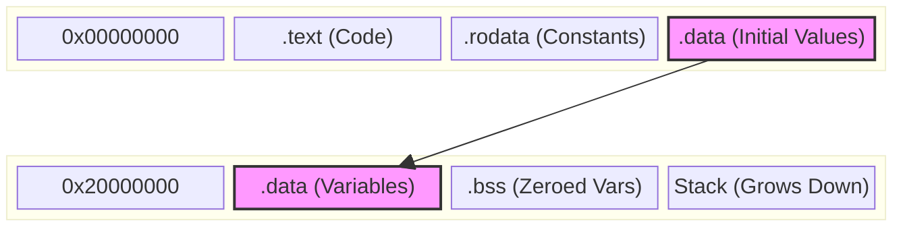

# Module 1: The Silicon & The Software

## Overview
**Goal**: To understand the "Bare Metal" environment. We will not write any "application" code until we have manually set up the C runtime environment.

In this module, we replace the "magic" that usually happens before `main()` with our own code.

## 1. Deep Dive: The Bare Metal Philosophy
"Bare Metal" means writing software that runs directly on the hardware without an Operating System (OS) like Linux or Windows.
*   **Total Control**: You control every single clock cycle and every bit of memory.
*   **No Safety Net**: If you access an invalid memory address, the CPU crashes (Hard Fault). There is no "Task Manager" to kill your app.

### Alternatives to Bare Metal
1.  **Arduino / Wiring**:
    *   *What*: A C++ abstraction layer that hides registers (e.g., `digitalWrite` instead of `GPIOA->ODR`).
    *   *Pros*: Extremely fast prototyping, huge community.
    *   *Cons*: Slow (abstraction overhead), hides the "real" hardware, hard to debug low-level issues.
2.  **MicroPython / CircuitPython**:
    *   *What*: Running a Python interpreter on the chip.
    *   *Pros*: No compilation, very easy to learn.
    *   *Cons*: Very slow, high memory usage, not suitable for hard real-time constraints.
3.  **Embedded Linux**:
    *   *What*: Running a full OS (requires MMU and lots of RAM).
    *   *Pros*: Networking, Filesystems, Multi-process support out of the box.
    *   *Cons*: Long boot time, non-deterministic (not real-time), high power consumption.

### Advantages of Bare Metal C
*   **Performance**: The fastest possible code execution.
*   **Determinism**: You know exactly how long a function takes to run.
*   **Efficiency**: Runs on chips with < 4KB of RAM and < $0.50 cost.

### Future Advancements: Embedded Rust
The industry is slowly moving towards **Rust** for embedded development.
*   **Memory Safety**: Rust prevents buffer overflows and null pointer dereferences at *compile time*.
*   **No Overhead**: Zero-cost abstractions (similar to C++).
*   **The Shift**: While C is still King, safety-critical industries (Automotive, Aerospace) are investigating Rust to prevent common bugs.

---

## Labs Breakdown

### Lab 1.1: The Linker Script (`linker_script.ld`)
**Objective**: Define the memory map of our virtual chip.
*   **Concept**: The CPU doesn't know where RAM or Flash is. We must tell it.
*   **Activity**: We define `FLASH` starting at `0x00000000` and `RAM` at `0x20000000`. We then tell the linker to put code (`.text`) in Flash and variables (`.data`, `.bss`) in RAM.



### Lab 1.2: Startup Code (`startup.c`)
**Objective**: Write the `Reset_Handler`.
*   **Concept**: When the CPU powers on, it looks at address `0x00000004` for the address of the first function to run.
*   **Activity**:
    1.  **Copy Data**: We manually write a loop to copy the initial values of variables from Flash (where they are stored safely) to RAM (where we can change them).
    2.  **Zero BSS**: We write `0` to all uninitialized variables.
    3.  **Call Main**: Finally, we jump to `main()`.

### Lab 1.3: Memory Mapped I/O (`main.c`)
**Objective**: Blink an LED without a driver library.
*   **Concept**: Peripherals are just memory addresses.
*   **Activity**: We create a `struct` that mimics the hardware registers of a GPIO port and point it to a specific address. Writing to this struct controls the "hardware".

## How to Run
1.  Navigate to the project folder:
    ```bash
    cd project
    ```
2.  Build the firmware:
    ```bash
    mkdir build
    cd build
    cmake -DCMAKE_TOOLCHAIN_FILE=../arm_gcc_toolchain.cmake -G "Unix Makefiles" ..
    make
    ```
3.  **Verify**:
    *   Check `firmware.map` to see where your variables ended up.
    *   Run `arm-none-eabi-objdump -d firmware` to see the assembly code.
