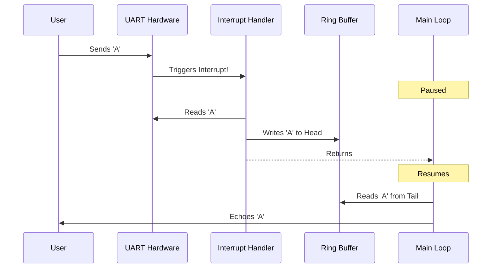

# Module 2: Communication Foundations (UART)

## Overview
**Goal**: Build a robust "Diagnostic Console" that can receive commands from a user without freezing the system.

## 1. Deep Dive: UART (Universal Asynchronous Receiver-Transmitter)
UART is the "Grandfather" of serial protocols. It's simple, robust, and ubiquitous.

### Alternatives to UART
1.  **I2C (Inter-Integrated Circuit)**:
    *   *Vs UART*: I2C is synchronous (has a clock), supports multiple slaves on the same bus, but is generally slower and more complex to implement in software.
    *   *Use Case*: Connecting sensors (Temp, Accel) on the same PCB.
2.  **SPI (Serial Peripheral Interface)**:
    *   *Vs UART*: SPI is much faster (MHz range) but requires more wires (4 vs 2).
    *   *Use Case*: Displays, SD Cards, Flash Memory.
3.  **USB (Universal Serial Bus)**:
    *   *Vs UART*: USB is vastly more complex, faster, and provides power.
    *   *Use Case*: Connecting to a PC (Modern MCUs often have USB-to-UART bridges built-in).

### Advantages of UART
*   **Simplicity**: Only 2 wires (TX/RX). No clock line needed.
*   **Long Distance**: With RS-232 or RS-485 transceivers, it can go hundreds of meters (unlike I2C/SPI which are PCB-only).
*   **Debug Friendly**: It outputs human-readable text. You can plug it into any computer and see what's happening.

### Future Advancements
1.  **Single-Wire UART**: Used in some modern sensors and servos (like Dynamixel) to save pins. Half-duplex.
2.  **High-Speed UARTs**: Modern SoCs support UARTs running at 4Mbps+ for Bluetooth/Wi-Fi chip communication.
3.  **Virtual UARTs (Semihosting/RTT)**:
    *   **Segger RTT (Real Time Transfer)**: Instead of using a physical UART peripheral, the debugger reads memory directly to simulate a console. It's incredibly fast (microseconds) and doesn't waste CPU cycles waiting for baud rates.

---

## Labs Breakdown

### Lab 2.1: Polled UART
**Objective**: Send "Hello World".
*   **Concept**: Write to the Data Register (`DR`) and wait for the Status Register (`SR`) to say "Done".
*   **Limitation**: The CPU is stuck waiting while the byte is being sent.

### Lab 2.2: Interrupt-Driven UART & Ring Buffer
**Objective**: Receive data in the background.
*   **Concept**: When a byte arrives, the CPU pauses, runs `UART1_IRQHandler`, saves the byte to a buffer, and resumes.
*   **Ring Buffer**: A circular queue that allows the ISR to write data and the Main Loop to read it at its own pace.



### Lab 2.3: Command Line Interface (CLI)
**Objective**: Parse text commands.
*   **Activity**: We build a simple shell that accepts commands like `led_on`, `led_off`, and `help`.

## How to Run
1.  Navigate to `module_2_uart/project`.
2.  Build:
    ```bash
    mkdir build
    cd build
    cmake -DCMAKE_TOOLCHAIN_FILE=../../module_1_fundamentals/project/arm_gcc_toolchain.cmake -G "Unix Makefiles" ..
    make
    ```
