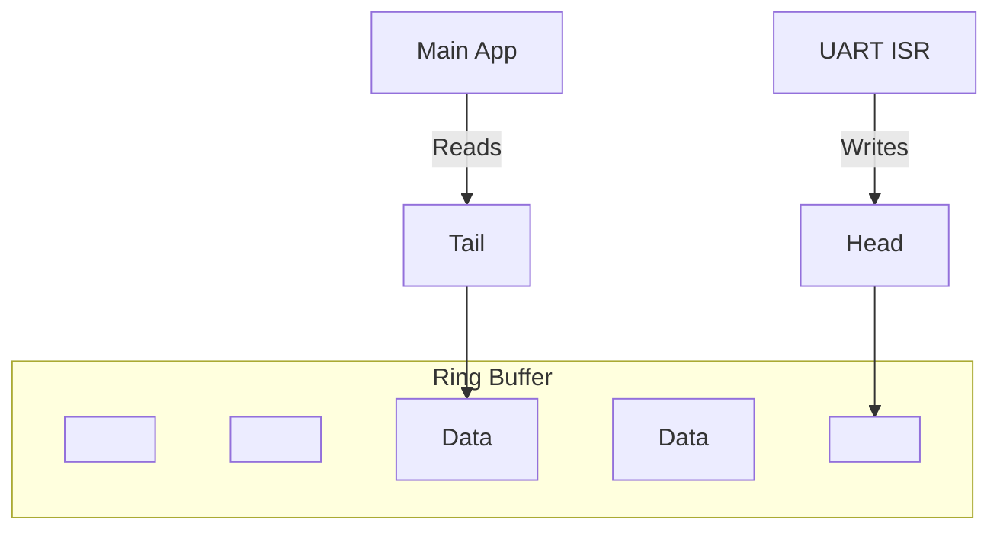

# Module 2: Communication Foundations - Theory Deep Dive

## 1. UART (Universal Asynchronous Receiver-Transmitter)

UART is the most common debug interface in embedded systems. It allows your chip to "talk" to your computer.

### 1.1 The Protocol
*   **Asynchronous**: No clock signal is sent. Both sides must agree on the speed (**Baud Rate**) beforehand (e.g., 115200 bits/second).
*   **Framing**:
    *   **Start Bit**: Logic Low (0). Signals the receiver to start its internal timer.
    *   **Data Bits**: Usually 8 bits (LSB first).
    *   **Stop Bit**: Logic High (1). Signals the end of the packet.
*   **Physical Layer**:
    *   **TTL**: 0V to 3.3V (What the MCU uses).
    *   **RS-232**: -12V to +12V (Old PC standard, requires a level shifter like MAX232).

### 1.2 Polling vs. Interrupts

How do we know when data has arrived?

#### Method A: Polling (The "Are we there yet?" approach)
The CPU constantly checks a status flag in a loop.
```c
while (!(UART->SR & RXNE)); // Wait until Receive Not Empty
char c = UART->DR;          // Read data
```
*   **Pros**: Simple.
*   **Cons**: Wastes 100% of CPU time waiting. If the CPU is busy doing something else when data arrives, the data might be overwritten (Overrun Error).

#### Method B: Interrupts (The "Doorbell" approach)
The CPU goes about its business. When data arrives, the UART hardware triggers an **Interrupt Request (IRQ)**.
1.  CPU pauses the main code.
2.  CPU saves its context (registers) to the stack.
3.  CPU jumps to the **Interrupt Service Routine (ISR)**.
4.  ISR reads the data and saves it.
5.  CPU restores context and resumes main code.

## 2. Ring Buffers (Circular FIFOs)

Even with interrupts, we have a problem. The ISR must be *fast*. It shouldn't print to the screen or parse complex commands. It should just grab the byte and exit.

Where do we put the byte? In a **Ring Buffer**.

### 2.1 How it Works
A fixed-size array with two pointers: `Head` (Write) and `Tail` (Read).

*   **Write (ISR)**: `Buffer[Head] = data; Head++;`
*   **Read (Main Loop)**: `data = Buffer[Tail]; Tail++;`
*   **Wrap Around**: When `Head` reaches the end of the array, it goes back to index 0.



## 3. The NVIC (Nested Vectored Interrupt Controller)

The NVIC is the "Receptionist" of the ARM Cortex-M core. It manages all interrupts.
*   **Priorities**: You can assign urgency to interrupts. A high-priority interrupt can interrupt a low-priority one (Nesting).
*   **Enable/Disable**: You must explicitly enable the UART IRQ in the NVIC for it to work.
