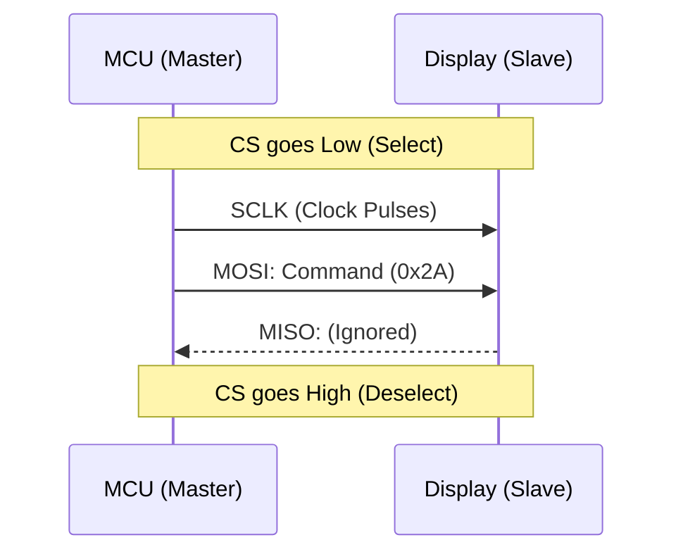

# Module 3: Synchronous Protocols (SPI)

## Overview
**Goal**: Build a "Digital Dashboard" by interfacing with a simulated Display Controller.

## 1. Deep Dive: SPI (Serial Peripheral Interface)
SPI is the "Muscle" of embedded protocols. It moves data fast.

### Alternatives to SPI
1.  **I2C**:
    *   *Vs SPI*: I2C is much slower (400kHz vs 50MHz+).
    *   *Why use I2C?* It uses only 2 wires for *many* devices. SPI needs 3 wires + 1 CS wire *per device*.
2.  **Parallel (8080/6800 MCU Interface)**:
    *   *Vs SPI*: Sends 8, 16, or 32 bits at once. Much faster but requires huge pin count (16+ pins).
    *   *Why use SPI?* To save pins on smaller microcontrollers.

### Advantages of SPI
*   **Speed**: Can easily reach 50Mbps or 100Mbps.
*   **Simplicity**: No complex addressing or state machine (like I2C). It's just a shift register.
*   **Full Duplex**: Can send and receive simultaneously (though rarely used in simple sensors).

### Future Advancements: QSPI & OSPI
Standard SPI has 1 data line (MOSI).
1.  **Dual SPI**: Uses 2 data lines. Double the speed.
2.  **Quad SPI (QSPI)**: Uses 4 data lines.
    *   *Usage*: Almost exclusively used for **External Flash Memory** (XIP - Execute In Place). The MCU can run code directly from an external chip as if it were internal flash.
3.  **Octal SPI (OSPI)**: Uses 8 data lines. Even faster, approaching parallel speeds with fewer pins.

---

## Labs Breakdown

### Lab 3.1: SPI HAL Driver
**Objective**: Create a generic SPI driver.
*   **Concept**: Configure the SPI peripheral as **Master**.
*   **Activity**: Implement `SPI_Init()` and `SPI_Transfer()`.

### Lab 3.2: Mock Display Driver
**Objective**: Draw pixels.
*   **Concept**: **Layering**. The Display Driver uses the SPI Driver. It doesn't care *how* the bytes get there, just that they do.
*   **Activity**: Implement `Display_DrawPixel()` which sends commands (Set Cursor) and data (Color) to the screen.

### Lab 3.3: The Dashboard
**Objective**: Draw the UI.
*   **Activity**: Use the display driver to draw boxes for Speed and RPM.

## SPI Timing Diagram


## How to Run
1.  Navigate to `firmware_guide/module_3_spi/project`.
2.  Build:
    ```bash
    mkdir build
    cd build
    cmake -DCMAKE_TOOLCHAIN_FILE=../../module_1_fundamentals/project/arm_gcc_toolchain.cmake -G "Unix Makefiles" ..
    make
    ```
