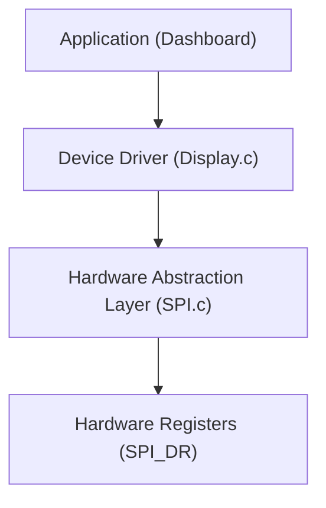

# Module 3: Synchronous Protocols (SPI) - Theory Deep Dive

## 1. SPI (Serial Peripheral Interface)

SPI is the "High Speed" highway of embedded systems. It is used for displays, SD cards, and high-speed sensors.

### 1.1 The Protocol
Unlike UART, SPI is **Synchronous**. It has a dedicated clock line.
*   **Master/Slave**: The MCU is usually the Master. It controls the clock.
*   **4 Wires**:
    1.  **SCLK** (Serial Clock): Generated by Master.
    2.  **MOSI** (Master Out Slave In): Data from MCU to Peripheral.
    3.  **MISO** (Master In Slave Out): Data from Peripheral to MCU.
    4.  **CS/SS** (Chip Select / Slave Select): Active Low. Tells the specific slave "I am talking to you".

### 1.2 Clock Polarity (CPOL) and Phase (CPHA)
SPI is flexible. You must match the Master's settings to the Slave's datasheet.
*   **Mode 0**: CPOL=0, CPHA=0 (Most common).
*   **Mode 1**: CPOL=0, CPHA=1.
*   **Mode 2**: CPOL=1, CPHA=0.
*   **Mode 3**: CPOL=1, CPHA=1.

*   **CPOL**: Idle state of the clock (Low or High).
*   **CPHA**: When data is sampled (Leading edge or Trailing edge).

## 2. Driver Architecture: HAL vs. Drivers

As our code grows, we need organization. We don't want `main.c` touching hardware registers directly.

### 2.1 The Layered Approach

1.  **HAL (Hardware Abstraction Layer)**:
    *   Knows about the **MCU** (STM32, AVR, etc.).
    *   Functions: `SPI_Init()`, `SPI_Transmit()`.
    *   Doesn't know *what* is connected (Display? Sensor?).

2.  **Device Driver**:
    *   Knows about the **External Component** (e.g., ILI9341 Display).
    *   Functions: `Display_DrawPixel()`, `Display_Clear()`.
    *   Uses the HAL to send bytes.
    *   Doesn't care which MCU is used.

## 3. Bit Banging vs. Hardware Peripheral

*   **Hardware SPI**: Dedicated silicon handles the shifting. Fast (up to 50MHz). CPU just writes a byte and leaves.
*   **Bit Banging**: Software manually toggles GPIO pins. Slow. Useful if you run out of hardware pins or need a weird protocol.
    *   *We will use the Hardware Peripheral simulation.*
