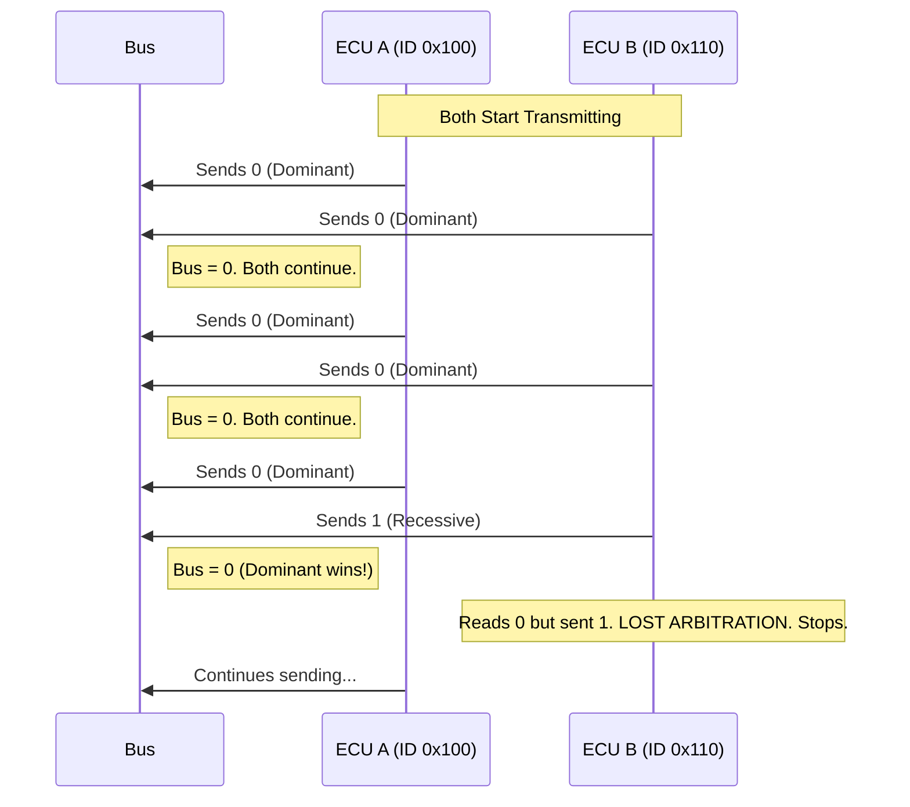

# Module 4: The Automotive Backbone (CAN)

## Overview
**Goal**: Simulate a vehicle network where ECUs broadcast data like Engine RPM and Vehicle Speed.

## 1. Deep Dive: CAN (Controller Area Network)
CAN is the standard for reliable, multi-master communication in harsh environments.

### Alternatives to CAN
1.  **LIN (Local Interconnect Network)**:
    *   *Vs CAN*: Single wire, much slower (20kbps), Master-Slave (not Multi-Master).
    *   *Use Case*: Non-critical things like Windows, Mirrors, Wipers. Cheaper than CAN.
2.  **FlexRay**:
    *   *Vs CAN*: Much faster (10Mbps), deterministic (Time Triggered), redundant (two channels).
    *   *Use Case*: Drive-by-wire, Active Suspension. Very expensive and complex.
3.  **MOST (Media Oriented Systems Transport)**:
    *   *Use Case*: Audio/Video (Infotainment). Being replaced by Ethernet.

### Advantages of CAN
*   **Robustness**: Differential signaling makes it immune to electromagnetic noise (Spark plugs, Alternators).
*   **Arbitration**: Non-destructive collision handling. The highest priority message *always* gets through immediately.
*   **Flexibility**: You can add a new ECU to the bus without reprogramming the others.

### Future Advancements
1.  **CAN-FD (Flexible Data-rate)**:
    *   *The Upgrade*: Standard CAN is limited to 1Mbps and 8 bytes of data. CAN-FD goes up to **5-8Mbps** and **64 bytes** of data.
    *   *Status*: Standard in almost all new cars.
2.  **CAN XL**: The next generation, targeting 10Mbps+.
3.  **Automotive Ethernet (100BASE-T1 / 1000BASE-T1)**:
    *   *The Revolution*: Uses a single twisted pair (lighter than standard CAT5).
    *   *Use Case*: Cameras, Lidar, Radar, Backbone connectivity. It doesn't replace CAN for low-level control, but handles the "Big Data".

---

## Labs Breakdown

### Lab 4.1: CAN Initialization
**Objective**: Set up the CAN Controller.
*   **Concept**: **Bit Timing**. CAN requires precise timing configuration (Quanta, Segments) to ensure all nodes sample at the same point.
*   **Activity**: Configure the Bit Timing Register (`BTR`) for 500kbps.

### Lab 4.2: Loopback Mode
**Objective**: Verify the driver without a second ECU.
*   **Concept**: **Loopback**. The CAN controller internally connects TX to RX. This allows the ECU to "hear itself".
*   **Activity**: Send a frame and verify it appears in the Receive FIFO.

### Lab 4.3: Vehicle Simulator
**Objective**: Simulate a running engine.
*   **Activity**:
    1.  Increment a variable `rpm`.
    2.  Pack it into a CAN Frame (ID `0x100`).
    3.  Broadcast it on the bus.

## CAN Arbitration Diagram
How CAN handles collisions:



## How to Run
1.  Navigate to `firmware_guide/module_4_can/project`.
2.  Build:
    ```bash
    mkdir build
    cd build
    cmake -DCMAKE_TOOLCHAIN_FILE=../../module_1_fundamentals/project/arm_gcc_toolchain.cmake -G "Unix Makefiles" ..
    make
    ```
