# Module 5: Real-Time Architecture (RTOS)

## Overview
**Goal**: Integrate all previous modules into a multitasking "Smart Dashboard".

## 1. Deep Dive: Real-Time Operating Systems
An RTOS provides the "Illusion of Concurrency" on a single core.

### Alternatives to RTOS
1.  **Super-Loop (Bare Metal)**:
    *   *Structure*: `while(1) { TaskA(); TaskB(); }`
    *   *Pros*: Simple, zero RAM overhead, easy to debug.
    *   *Cons*: If TaskA takes too long, TaskB waits. Non-deterministic.
2.  **State Machines**:
    *   *Structure*: Breaking tasks into tiny non-blocking steps.
    *   *Pros*: Very efficient.
    *   *Cons*: Spaghetti code (Callback Hell) as complexity grows.

### Advantages of RTOS
*   **Determinism**: You can guarantee that High Priority Task A *will* run every 1ms, no matter what Task B is doing.
*   **Modularity**: You can write `CAN_Task` and `Display_Task` as completely separate programs that don't know about each other.
*   **Ecosystem**: Comes with drivers, filesystems, and networking stacks (TCP/IP).

### Future Advancements: Zephyr & Multicore
1.  **Zephyr OS**:
    *   *The Rising Star*: A Linux Foundation project. It's an RTOS but with a "Linux-like" build system (Device Tree, Kconfig). It is rapidly becoming the standard for IoT and modern embedded.
2.  **SafeRTOS / Azure RTOS**:
    *   *Safety*: Pre-certified for ISO 26262 (Automotive Safety).
3.  **Multicore Microcontrollers**:
    *   *AMP (Asymmetric Multi-Processing)*: One core runs the RTOS (UI/Comms), another core runs the Motor Control loop (Bare Metal).
    *   *SMP (Symmetric Multi-Processing)*: The RTOS schedules tasks across multiple cores automatically.

---

## Labs Breakdown

### Lab 5.1: Mini-RTOS Kernel
**Objective**: Understand Context Switching.
*   **Concept**: The **Scheduler** pauses one function and resumes another.
*   **Activity**: Implement `RTOS_CreateTask` to set up a fake stack frame, and `RTOS_Scheduler` to switch between them.

### Lab 5.2: The Smart Dashboard
**Objective**: Run CAN, Display, and UART simultaneously.
*   **Activity**:
    *   **Task 1 (CAN)**: Listens for RPM messages.
    *   **Task 2 (Display)**: Draws the gauges based on the shared RPM variable.
    *   **Task 3 (Console)**: Prints debug info to UART.

## RTOS Scheduling Diagram

```mermaid
gantt
    title Round Robin Scheduling (1ms Tick)
    dateFormat  s
    axisFormat %s
    
    section CPU Usage
    Task CAN      :active, t1, 0, 1
    Task Display  :        t2, 1, 2
    Task Console  :        t3, 2, 3
    Task CAN      :active, t4, 3, 4
```


## How to Run
1.  Navigate to `firmware_guide/module_5_rtos/project`.
2.  Build:
    ```bash
    mkdir build
    cd build
    cmake -DCMAKE_TOOLCHAIN_FILE=../../module_1_fundamentals/project/arm_gcc_toolchain.cmake -G "Unix Makefiles" ..
    make
    ```
